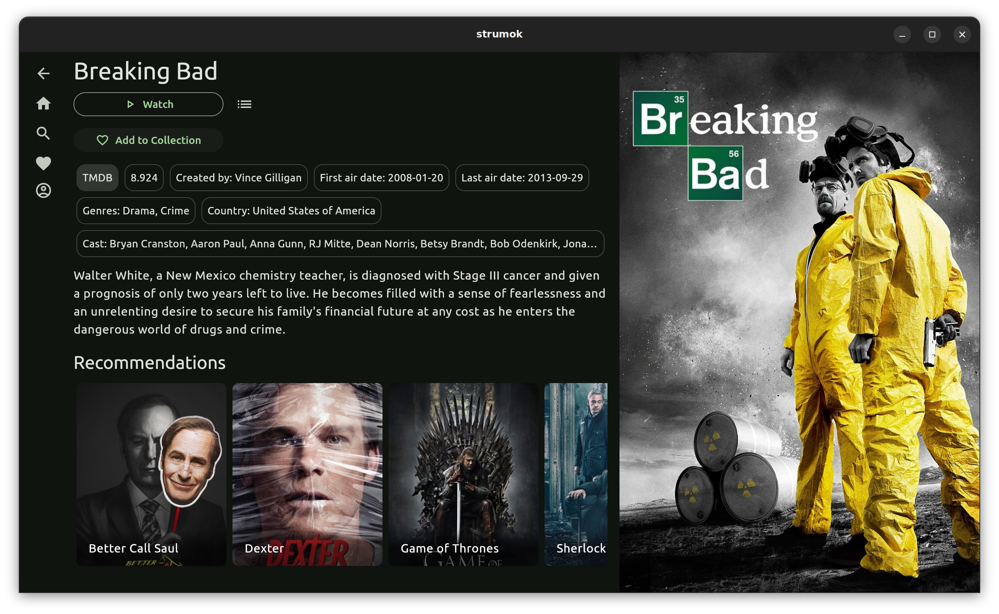
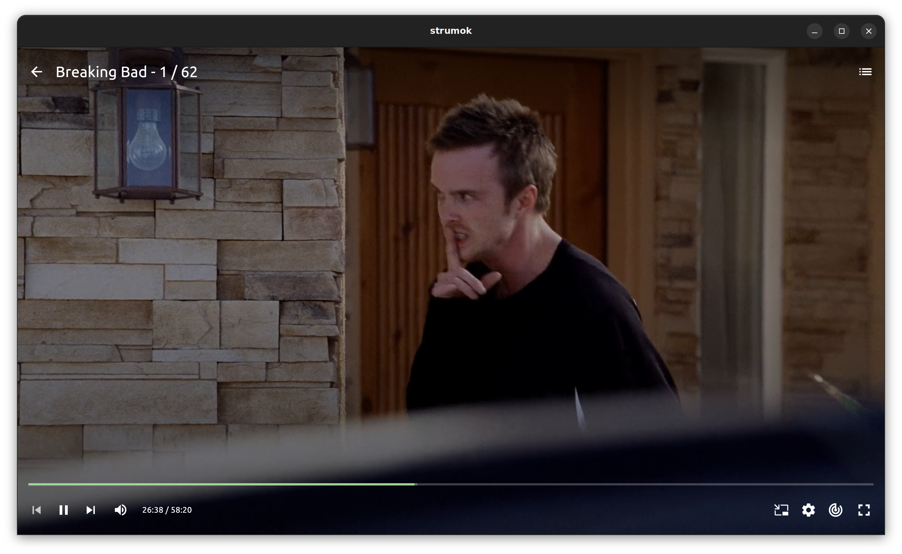

 

 

# Strumok 

Watch movies, tv shows, anime and read manga in one app on android, windows and linux.

## Features
* AdFree
* English and ukrainian content
* Customizable recommendations
* Collection synchronized across devices
* Android TV remote control support
* Downloads

## Screenshots

### Home page

### Collection

### Details

### Video player

### Manga reader

## Installation

### Android / Android TV

[Download](https://github.com/strumok-app/strumok/releases/download/latest/app-release.apk) android universal apk

### Windows

[Download](https://github.com/strumok-app/strumok/releases/download/latest/StrumokSetup.exe) windows installer

### Linux

Install [libmpv](https://mpv.io/installation/)

[Download](https://github.com/strumok-app/strumok/releases/download/latest/strumok-linux.tar.gz) archive and unpack

### Disclaimer

The developer of this application does not have any affiliation with the content providers available.